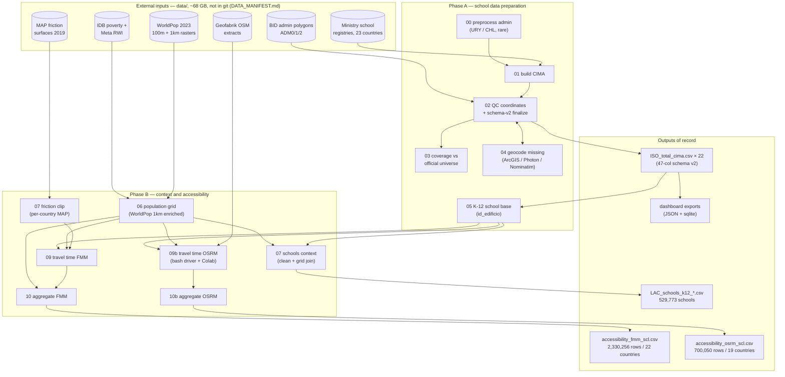

# School Accessibility Platform

### Inter-American Development Bank (IDB/BID)

Municipality-level indicators of school accessibility and equity for **22 Latin
American and Caribbean countries** (23 operational — HTI runs through the pipeline
but is excluded from analysis). Covers **529,773 K-12 schools** (public + private)
to support education infrastructure budgeting, planning, and accountability.

> **About this repository.** This is the curated **delivery repository** for the
> IDB: production pipeline, test suite, and methodology documentation. Day-to-day
> development, exploratory exercises (Mapbox, r5py, RWI-vs-poverty pilots) and
> session history live in the working repository (`AngelaLop/accessibility_platform`).
> The `data/` bundle (~68 GB) is distributed separately via IDB storage — see
> `DATA_MANIFEST.md`.

Two travel-time methodologies are computed side by side:

- **FMM** (Fast Marching Method over MAP friction surfaces) — full-coverage
  raster method; systematically optimistic, treated as the *upper bound*.
- **OSRM** (network routing over OpenStreetMap) — road-network travel times;
  the primary methodology for the BID deliverable.

---

## 1. Architecture



Exploratory comparisons against third-party routers (Mapbox Matrix API, r5py)
were used to stress-test the methodology but are **not part of the delivery**;
they remain in the development repository.

---

## 2. Repository structure

```
idb-school-accessibility/
├── pipeline/                       # Numbered pipeline scripts (run from project root)
│   ├── 00_preprocess_admin.py      # Reshape URY/CHL admin CSVs (rare)
│   ├── 01_build_cima.py            # Build CIMA files from raw ministry data
│   ├── 02_qc_coordinates.py        # QC + schema-v2 finalize (owns coordinate_quality)
│   ├── 03_coverage_assessment.py   # Coverage vs official universe
│   ├── 04_geocode_missing.py       # Geocoder cascade + centroid fill (score-based QC)
│   ├── 05_base_k_12_clean.py       # id_edificio resolution + 14-col school base
│   ├── 06_pop_grid.py              # WorldPop 1km grid (pop, area_class, RWI, poverty)
│   ├── 07_friction_clip.py         # Clip MAP friction surfaces per country
│   ├── 07_schools_context.py       # Schools + grid context → LAC K-12 base
│   ├── 09_travel_time_fmm.py       # FMM travel-time rasters (2 modes × 3 levels)
│   ├── 09b_travel_time_osrm.py     # OSRM table queries (cell → K nearest schools)
│   ├── 09b_osrm_build_and_run.sh   # OSRM graph build + server driver (bash/Docker)
│   ├── 10_accessibility_aggregate.py    # FMM → SCL long format
│   ├── 10b_accessibility_aggregate_osrm.py  # OSRM → SCL long format
│   ├── constants.py                # Single source of truth (scope, schema, enums)
│   ├── qc_core.py                  # Shared QC helpers
│   ├── _paths.py                   # DATA_ROOT / RESULTS_ROOT (env-var overridable)
│   └── run_all.py                  # Steps 01–03 in sequence
├── tests/                          # pytest suite (857 tests; data-dependent tests skip without the bundle)
├── notebooks/                      # Colab: OSRM for ARG/MEX/BRA, RWI extraction
├── docs/                           # Methodology, QC specs, audits, limitations log
├── data/                           # NOT in git — the IDB data bundle mounts here (DATA_MANIFEST.md)
├── results/                        # Created by pipeline runs / shipped in the data bundle
├── DATA_MANIFEST.md                # External-input contract (sources, versions, layout)
├── definitions.md                  # Urban/semi-urban/dispersed thresholds
└── pyproject.toml + uv.lock        # Pinned environment (uv)
```

---

## 3. Country scope

23 countries run through the pipeline (`PIPELINE_ISOS` in `pipeline/constants.py`);
**22 are published** — HTI is excluded (raw `.xls` unreadable). Validation depth
varies by what each country's raw data supports: 15 countries validate coordinates
at municipality level (`adm2`), 5 at department level (`adm1`, incl. BHS), JAM is
`spatial_only`, BRB `bbox_only`. `COUNTRY_SCOPE` in `pipeline/constants.py` is
authoritative; per-country notes live in `docs/coordinate_quality_spec.md` §7
and `docs/pipeline_history.md`.

---

## 4. Coordinate quality (schema v2)

Every school carries a `coordinate_quality` label from an 11-value taxonomy
resolved worst-flag-first — `missing`, `out_of_bounds`, `swapped`, `adm_mismatch`,
`cluster_centroid`, `geocoder_disagrees`, `boundary_zone`, `geocoded_centroid`,
`geocoded_street`, `gps_validated`, `gps_unverified` — plus two additive scope
columns: `qc_scope_class` (mainland / remote-territory / near-border / outside)
and `include_in_spatial_indicators` (`True` / `False` / blank = review).

Downstream indicator code must consult `qc_scope_class` /
`include_in_spatial_indicators`, not `coordinate_quality` alone (valid island
schools can be `out_of_bounds` under the mainland bbox semantics).

Full spec with per-label rules, counts, and country notes:
**`docs/coordinate_quality_spec.md`**. Column contract: `CIMA_ENRICHED_COLUMNS`
(47 columns) in `pipeline/constants.py`.

---

## 5. Geocoding quality framework

~6% of schools lack GPS from ministry data. Geocoder accuracy was validated
against **550 schools with known GPS** across 11 countries:

| ArcGIS score | Classification | Median error | Action (fill) |
|---|---|---|---|
| ≥ 95 | `street` | 0.2 km | Accept |
| 90–95 | `centroid` | 4.4 km | Accept as centroid precision |
| < 90 | `uncertain` | 8.1 km | **Reject** (leave empty) |

**Key principle: ministry GPS is never replaced.** The geocoder only fills gaps.
Evidence and audit trail ship with the data bundle:
`results/geocoder_ground_truth_all_countries.csv` (validation set) and
`results/geocode_results.csv` (append-only ledger). Outcomes of record live in
each `{ISO}_total_cima.csv`.

---

## 6. Urban / rural classification

Each 1 km WorldPop pixel is classified by density and population
(thresholds in `definitions.md`):

| Class | Density | Population |
|---|---|---|
| Urban | ≥ 300 hab/km² | ≥ 5,000 |
| Semi-urban | ≥ 150 hab/km² | 200–5,000 |
| Dispersed | < 150 hab/km² | < 200 |

Applied in Step 06 and propagated through Steps 07–10, so every accessibility
indicator disaggregates by settlement class. In the SCL output the `dispersed`
class is published under the label `rural` (`AREA_MAP`, Step 10).

---

## 7. Indicators (SCL long format)

Steps 10/10b emit one long/tidy table per methodology
(`results/accessibility/accessibility_{fmm,osrm}_scl.csv`), keyed by
country × admin level × area class × sector × education level × time threshold:

- **% population within 15/30/60 min** of the nearest school (motorized + walking)
- **Mean travel time** (population-weighted)
- Disaggregated by **sector** (public / private / total) and **education level**
  (primary 6–11, lower secondary 12–14, upper secondary 15–17)
- Equity context from Step 06: IDB poverty / NBI rates, Meta RWI

URY publishes at department level only (`ADM1_ONLY_ISOS`): its adm2 units are
unnamed census sections and the education budget is national (ANEP).

---

## 8. Pipeline status (2026-07-03)

| Step | Scope | Status |
|---|---|---|
| 01 Build CIMA | 23 countries | Done |
| 02 QC + schema v2 | 22 analysis countries | Done (47-col contract, 2026-05-08) |
| 03 Coverage | 22 | Done |
| 04 Geocoding | 13 countries B-1, 4 cascade | Done for delivery; partial re-runs backlog |
| 05 K-12 base | 22 | Done |
| 06 Population grid | 22 (HTI has no WorldPop) | Done, validated ±2% vs World Bank 2023 |
| 07 Friction clip | 23 | Done |
| 07 Schools context | 22 → LAC K-12 base | Done (529,773 schools) |
| 09 FMM | 22 | Done (2,330,256 SCL rows) |
| 09b OSRM | 19 of 22 | ARG / BRA / MEX pending via Colab (`notebooks/colab_osrm_country.ipynb`) |
| 10 / 10b Aggregate | per methodology | Done for computed scopes |

---

## 9. Running the pipeline

All scripts run from the project root with [uv](https://docs.astral.sh/uv/) —
`uv sync` restores the pinned environment (`uv.lock` + `.python-version 3.13`).
Data must be in place first: **see `DATA_MANIFEST.md`** (68 GB bundle on IDB
storage; override locations with `IDB_ACCESS_DATA_ROOT` / `IDB_ACCESS_RESULTS_ROOT`).

```bash
# Phase A core (steps 01–03 in sequence)
uv run python pipeline/run_all.py

# On-demand steps
uv run python pipeline/04_geocode_missing.py --countries {ISO}
uv run python pipeline/05_base_k_12_clean.py --countries all
uv run python pipeline/06_pop_grid.py --countries all
uv run python pipeline/07_schools_context.py --step join   # then: lac, lac-clean
uv run python pipeline/09_travel_time_fmm.py
bash pipeline/09b_osrm_build_and_run.sh                    # needs bash + Docker (or Colab)
uv run python pipeline/10_accessibility_aggregate.py
uv run python pipeline/10b_accessibility_aggregate_osrm.py

# Tests
uv run pytest tests/ -q
```

Reproducibility notes: the Python environment is bit-pinned; the known
provenance gaps (OSM `latest` extracts, untagged OSRM image, per-run manifest)
are documented in `DATA_MANIFEST.md` §6 and
`docs/pipeline_data_audit_2026-05-27.md`. Step 04 calls live geocoding services
and is never re-run to reproduce past results — its outcomes are materialized
in the CIMA files.

---

## 10. Data sources

| Source | Coverage | Resolution | Use |
|---|---|---|---|
| Ministry school registries | 23 countries | School-level | Locations, levels, sector |
| BID admin polygons | LAC | ADM0/1/2 (12,531 ADM2) | Geographic frame |
| WorldPop 2023 (CN, R2025A) | Global | 100 m + 1 km | School-age population |
| MAP friction (Weiss et al. 2020) | Global | 1 km | FMM travel cost |
| Geofabrik OSM extracts | Per country | Road network | OSRM routing |
| IDB Poverty Maps | LAC | ADM1/ADM2 | Poverty, NBI |
| Meta Relative Wealth Index | Global | ~2.4 km | Wealth proxy |

---

*License: to be defined with the IDB before any publication. Ministry raw data
is not redistributed through this repository.*
